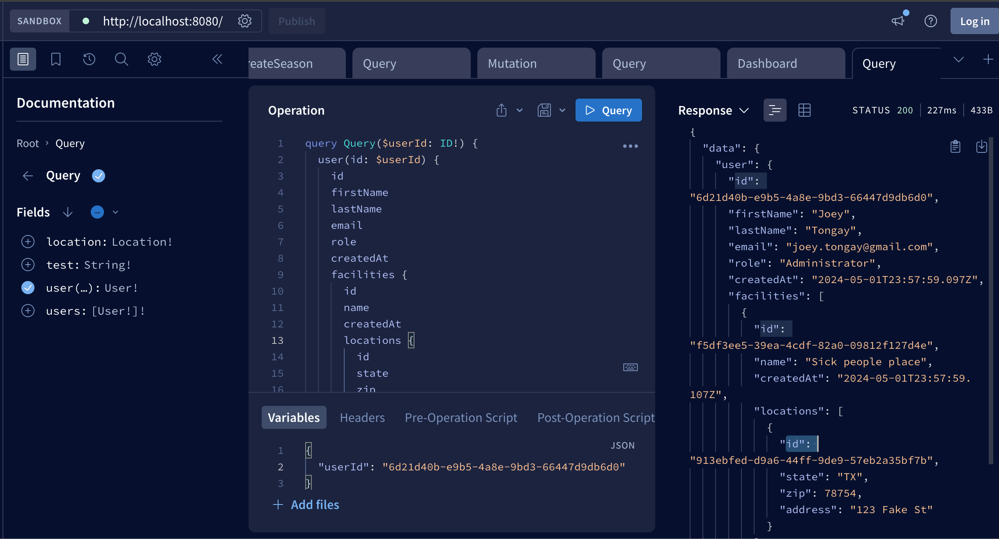
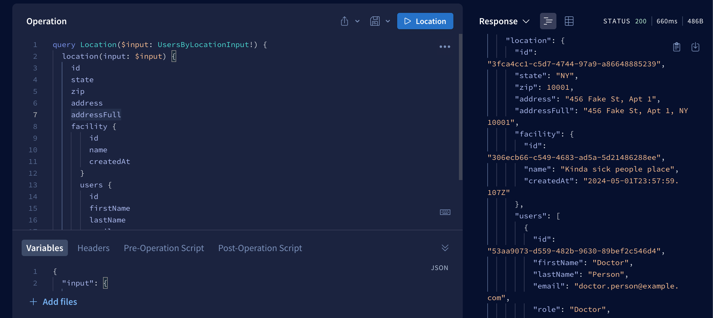

# Initial test
Building a GraphQL schema to satisfy the linked Queries

## Project Setup
The following steps should be taken to run the project locally

### Libraries installed
- Node version > 18
- pnpm
- Docker

### To run
- Start with installing dependencies via pnpm
```
pnpm install
```
- Run the DB container that creates the database, schema, and some seed entries
```
docker-compose up
```
- In a separate terminal window, run the server locally
```
pnpm start
```

#### You should see the server hosting on port 8080 (localhost:8080)

## Running the two queries





## Approach

### Database
I am by no means a Docker expert, but I wanted to have a real database for this example and not expect someone to have to have Postgres installed and running on their machines. I went ahead and just created a very simple and straightforward docker-compose file to start the postgres service locally, while allowing a locally running API server to connect to it. I business objects were straightforward and the desired queries were enough information to build an initial schema.

### Server
I'm very OOP principled, so I definitely prefer utilizing Classes with inheritance/abstractions. I have a BaseResolver that all resolvers must inherit from, and that type is being checked by the `resolverMap` function. This ensures that all resolves are type safe to start. I utilize the data fetching from classes on the GraphQL context from a custom context.
